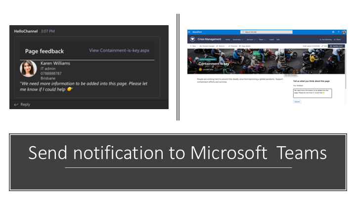

# react-page-feedback

## Summary

A simple SPFx feedback webpart which sends notifications to a Microsoft Teams channel when any user gives a feedback for a page in the portal.
Uses adaptive cards for both the feedback form as well as the notification message for the connector([Incoming Webhook](https://docs.microsoft.com/en-us/microsoftteams/platform/webhooks-and-connectors/how-to/add-incoming-webhook?WT.mc_id=m365-11878-rwilliams)) to post notification in Teams.

## Used SharePoint Framework Version

## Applies to

- [SharePoint Framework](https://aka.ms/spfx)
- [Microsoft 365 tenant](https://docs.microsoft.com/en-us/sharepoint/dev/spfx/set-up-your-developer-tenant?WT.mc_id=m365-11878-rwilliams)
- [Microsoft Graph]()
- [Adaptive cards](adaptivecards.io)
- [Incoming webhooks](https://docs.microsoft.com/en-us/microsoftteams/platform/webhooks-and-connectors/how-to/add-incoming-webhook?WT.mc_id=m365-11878-rwilliams)

> Get your own free development tenant by subscribing to [Microsoft 365 developer program](https://developer.microsoft.com/en-us/microsoft-365/dev-program?WT.mc_id=m365-11878-rwilliams)

## Solution

Solution|Author(s)
--------|---------
react-page-feedback.sppkg | [Rabia Williams](https://twitter.com/williamsrabia)

## Version history

Version|Date|Comments
-------|----|--------
1.0|December 13, 2020|Initial release

## Disclaimer

**THIS CODE IS PROVIDED *AS IS* WITHOUT WARRANTY OF ANY KIND, EITHER EXPRESS OR IMPLIED, INCLUDING ANY IMPLIED WARRANTIES OF FITNESS FOR A PARTICULAR PURPOSE, MERCHANTABILITY, OR NON-INFRINGEMENT.**

---

## Minimal Path to Awesome

- Clone this repository
- Ensure that you are at the solution folder
- in the command-line run:
  - **npm install**
  - **gulp serve**
- Update the webpart settings to have the URL to your configured Incoming Webhook URL, [see here how you can configure one](https://docs.microsoft.com/en-us/microsoftteams/platform/webhooks-and-connectors/how-to/add-incoming-webhook?WT.mc_id=m365-11878-rwilliams)

  > Microsoft Graph API  Permission has to be granted at a minimum of User.Read. Check this blog for more info on how to do that [Grant API Permission using CLI for Microsoft365](https://blog.mastykarz.nl/grant-api-permissions-office-365-cli/), previously knows as Office365CLI.

## Features

- The webhook URL is configurable for ease of change (should ideally be a secret, but used as a setting here for demo purpose)
- Uses Graph to get user information to be clear on the feedback card in Teams conversation.
- Used adaptive cards for easy development in SPFx as well as to post the message to Teams, making it more interactive and grab more attention.

## References

- [Getting started with SharePoint Framework](https://docs.microsoft.com/en-us/sharepoint/dev/spfx/set-up-your-developer-tenant?WT.mc_id=m365-11878-rwilliams)
- [Building for Microsoft teams](https://docs.microsoft.com/en-us/sharepoint/dev/spfx/build-for-teams-overview?WT.mc_id=m365-11878-rwilliams)
- [Use Microsoft Graph in your solution](https://docs.microsoft.com/en-us/sharepoint/dev/spfx/web-parts/get-started/using-microsoft-graph-apis?WT.mc_id=m365-11878-rwilliams)
- [Publish SharePoint Framework applications to the Marketplace](https://docs.microsoft.com/en-us/sharepoint/dev/spfx/publish-to-marketplace-overview?WT.mc_id=m365-11878-rwilliams)
- [Microsoft 365 Patterns and Practices](https://aka.ms/m365pnp) - Guidance, tooling, samples and open-source controls for your Microsoft 365 development
